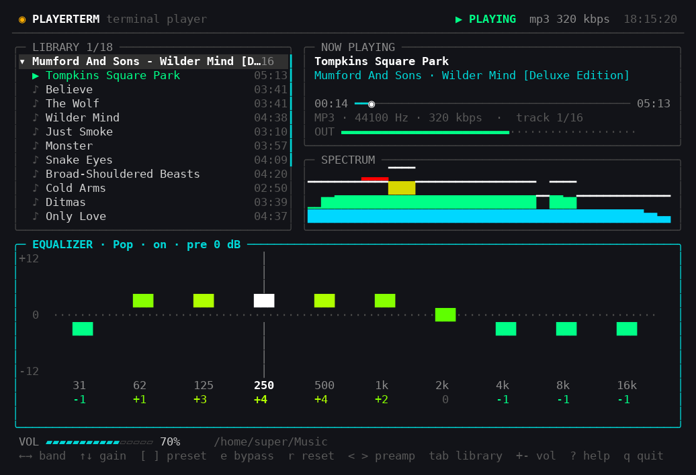

# playerTerm

A music player for the terminal, with a real ten band equalizer.



Browse your music as a folder tree, play an album at a time, and shape the
sound while it runs. ffmpeg decodes the files; everything after that is plain
Java — the filter bank, the spectrum analyser and the interface. No third
party libraries.

**Author:** Claude (Opus 5), written with Claude Code.

## Requirements

- Java 21+
- ffmpeg and ffprobe on `PATH` (set `PLAYERTERM_FFMPEG` / `PLAYERTERM_FFPROBE` to point elsewhere)
- a terminal that speaks 256 colours and UTF-8, at least 62x18

## Run it

```bash
./playerTerm                 # your music folder
./playerTerm ~/Downloads     # or any folder you name
```

Plays **mp3, flac, wav, ogg and opus**. Anything else in the folder — artwork, cue
sheets, text files — is ignored, and folders that contain no audio anywhere
beneath them never appear.

## Your music folder

Resolved in this order, first hit wins:

| | |
|---|---|
| a folder given on the command line | `./playerTerm /path/to/music` |
| `$PLAYERTERM_MUSIC` | |
| `$XDG_MUSIC_DIR` | |
| `XDG_MUSIC_DIR` in `~/.config/user-dirs.dirs` | what your desktop set |
| `~/Music` | last resort |

## Keys

| Library | |
|---|---|
| `↑` `↓` `j` `k` | move |
| `space` | fold a folder open or shut — or pause, when a track is selected |
| `→` `←` (`l` `h`) | expand / collapse; `←` on a track jumps to its folder |
| `Enter` | play — a folder plays its tracks, a track plays its folder from there |
| `n` `b` | next / previous track (`b` restarts the track after 3 seconds in) |
| `,` `.` | seek 5 seconds back / forward |
| `p` `s` | pause or resume, stop |
| `c` `o` | collapse everything, open everything |
| `PgUp` `PgDn` `g` `G` | page, top, bottom |

| Equalizer (`tab` switches panels) | |
|---|---|
| `←` `→` or `0`-`9` | select a band — the active slider turns white |
| `↑` `↓` | band gain, ±1 dB up to ±12 |
| `[` `]` | cycle presets |
| `e` | bypass the filter bank |
| `r` | back to flat |
| `<` `>` | preamp |

| Anywhere | |
|---|---|
| `+` `-` | volume |
| `m` | mute |
| `?` | key help |
| `q` | quit |

| Mouse | |
|---|---|
| click a folder | folds it open or shut |
| click a track | selects it; click again to play |
| click Now Playing | pauses or resumes |
| click the progress bar | seeks there; the wheel nudges 5 seconds |
| wheel | scrolls the library, or adjusts the band or volume under the pointer |
| drag an equalizer slider | the gain follows the pointer, even outside its column |

Mouse tracking means the terminal stops handling plain drag-to-select; hold
shift to select text as usual, or start with `--no-mouse` to leave the mouse
alone entirely.

## Command line

```
playerTerm [folder]              browse that folder instead of your music folder
playerTerm -m, --music <dir>     same thing, named
playerTerm --no-mouse            leave the mouse to the terminal
playerTerm -h, --help            show help
```

Volume, equalizer curve and the last track played are kept in
`~/.config/playerterm/config.properties` (honouring `XDG_CONFIG_HOME`).

## How it works

```
ffmpeg ──PCM s16le──▶ float ──▶ 10x biquad peaking filters (per channel)
                                   │
                                   ├──▶ preamp, volume, soft limiter ──▶ sound card
                                   └──▶ 2048 point FFT ──▶ spectrum bars
```

Each equalizer band is an RBJ peaking biquad at roughly one octave of
bandwidth, recalculated when a slider moves, so changes are audible
immediately without interrupting playback. A soft knee limiter after the gain
stage keeps heavy boosts from clipping.

**Scanning never opens a file.** Starting up only reads directory entries, so
a large library appears instantly. Tags and durations are filled in afterwards
by ffprobe on a background thread, the first time you open or play a folder —
which is why track titles replace file names a moment after a folder opens.
Vorbis keeps its comments on the stream rather than the container, so both are
read.

**Playing a folder** hands its tracks to one session thread, which decodes,
equalises and writes them in order, moving on to the next track by itself.
Pause stops the output line so the sound cuts immediately and the position
freezes. Seeking restarts ffmpeg with `-ss` ahead of the input, so a jump
costs one process restart rather than decoding everything skipped.

The interface is drawn straight to the terminal: a double buffered cell grid
diffed per row, 256 colour output, raw mode and SGR mouse reporting via
`stty`, and no curses.

## Layout

```
┌ header ─────────────────────────────────────────┐
│ folder tree       │ now playing + progress      │  top half
│                   │ spectrum                    │
├───────────────────┴─────────────────────────────┤
│ equalizer                                       │  bottom half
├─────────────────────────────────────────────────┤
│ volume · music folder · messages                │
└ keys ───────────────────────────────────────────┘
```
